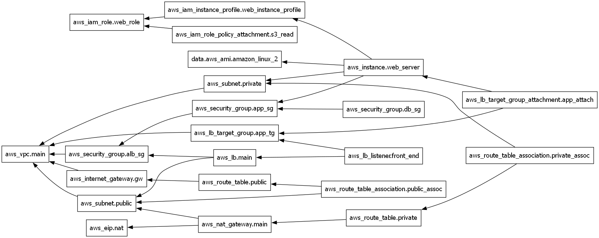

# 🛠️ Automated Multi-Tier Cloud Infrastructure
**A production-ready, secure AWS environment deployed via Terraform.**

## 📖 Overview
This project demonstrates the automated deployment of a highly available, 3-tier cloud architecture. It focuses on the **Principle of Least Privilege**, ensuring that application and database layers remain isolated from the public internet while allowing outbound traffic via a NAT Gateway.

## 🏗️ Architecture Features

* **VPC Design:** Custom VPC with a $10.0.0.0/16$ CIDR block.
* **Multi-AZ Reliability:** Subnets spread across two Availability Zones for high availability.
* **Security Chaining:** * **ALB Tier:** Public-facing, allows HTTP (80).
    * **App Tier:** Private, allows traffic **only** from the ALB Security Group.
    * **Data Tier:** Private, allows traffic **only** from the App Security Group.
* **Identity Management:** EC2 instances use **IAM Instance Profiles** to access AWS services (S3 Read-Only) instead of hardcoded access keys.
* **Automation:** Linux instances are automatically bootstrapped with Apache using Bash `user_data` scripts.

## 🚀 Deployment Success

## 📊 Terraform Dependency Graph

## 🛠️ Tools Used
* **IaC:** Terraform
* **Cloud:** AWS (VPC, EC2, IGW, NAT Gateway, ALB, S3, DynamoDB)
* **OS/Scripting:** Linux (Amazon Linux 2023), Bash
* **State Management:** S3 (Storage) and DynamoDB (State Locking)

## 🚀 How to Deploy
1. **Prerequisites:** AWS CLI configured and Terraform installed.
2. **Initialize:** `terraform init` (Sets up the S3 backend).
3. **Plan:** `terraform plan` (Review the 20+ resources to be created).
4. **Deploy:** `terraform apply -auto-approve`
5. **Access:** Copy the `alb_dns_name` output and paste it into your browser.

## 📈 Key Outcomes
* **Efficiency:** Reduced environment setup time by 90% compared to manual console configuration.
* **Security:** Achieved 100% isolation of the application tier from direct internet access.
* **Consistency:** Eliminated configuration drift by using remote state locking.

## 🔍 Verification & Testing
### 1. Web Access via ALB
The application is not directly accessible via a public IP. Access is routed through an Application Load Balancer:
- **DNS URL:** `http://<alb-dns-name>`
- **Expected Result:** Custom HTML page served from a private EC2 instance.

### 2. Connectivity Proof (NAT Gateway)
To verify the Private Subnet has internet egress for updates, the `user_data` script logs the `yum update` status. 
- **Command:** `tail /var/log/cloud-init-output.log` (Internal check via Session Manager).

### 3. Security Group Verification
- **ALB SG:** Only Port 80 is open to `0.0.0.0/0`.
- **App SG:** Only Port 80 is open to the **ALB Security Group ID**.
